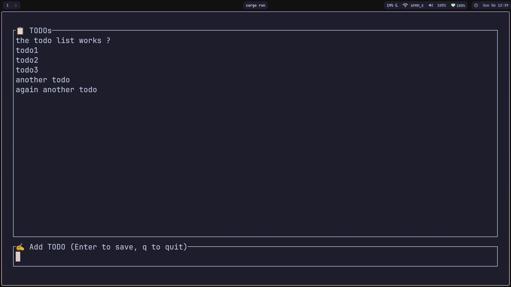

# 📋 Terminal TODO App

A minimal, clean and beginner-friendly TODO app you can run in your terminal — built with Rust, powered by `ratatui` and `crossterm`.



---

## ✨ Features

- 🖥️ Simple terminal UI
- ✅ Add todos with keyboard input
- 🔁 Real-time update as you type
- 🧠 Easy to understand for Rust beginners
- 💨 Lightweight and fast

---

## 🎮 Controls

| Key         | Action                |
| ----------- | --------------------- |
| `Type`      | Write your TODO item  |
| `Enter`     | Save it to the list   |
| `Backspace` | Remove last character |
| `Q`         | Quit the app          |

> i use capslock as super key so cap Q is far more easier for me you can change as per your Requirements.

---

## 🚀 Getting Started

### 1. Clone the Repo

```bash
git clone https://github.com/Pujan-Dev/TUI-TODO-RUST
cd terminal-todo
```

````

### 2. Add dependencies

Inside `Cargo.toml`:

```toml
[dependencies]
ratatui = "0.26"
crossterm = "0.27"
color-eyre = "0.6"
```

### 3. Run the App

```bash
cargo run
```

---

## 🗂️ Project Structure

```
src/
└── main.rs       # App code
Cargo.toml        # Dependencies
README.md         # This file
```

---

## 📦 Requirements

- 🦀 Rust (latest version recommended)
- 🧪 Terminal (Linux/macOS or WSL on Windows)

---

## 📄 License

MIT License — use it freely, build cool stuff, have fun 🚀

---

## 🧊 Made with Rust and chill
````
